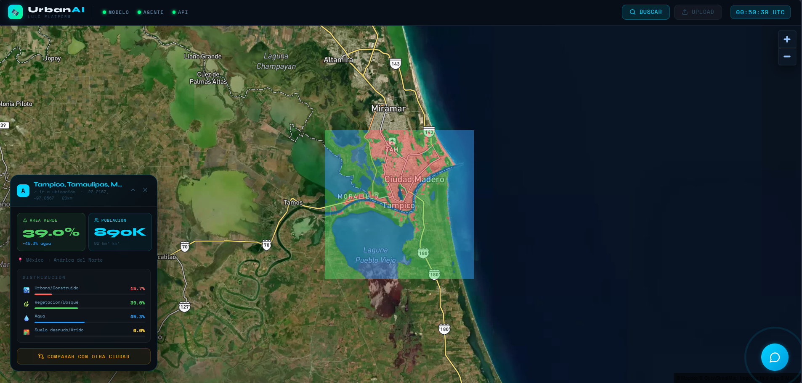

# UrbanAI  
_**Autor:**_ Gustavo de Jesús Escobar Mata.

## Descripción general
Los datos corresponden al catalago de imagenes de Sentinel-2. Se utilizaron imagenes satelitales de: Amsterdam, Bangkok, Bogota, Ciudad de México, Dubai, Houston, Madrid, Monterrey , Mumbai y  Nairobi. La elección fue basada en variedad de suelos y regiones.

## Problema 

## Solución

## Aarquitectura 

## Metricas
### Metricas generales
| Métrica                  | Valor        |
|--------------------------|-------------|
| Número de clases         | 4           |
| Muestras de prueba       | 22,639      |
| Test Loss                | 0.2019      |
| mIoU                     | 0.8239      |
| Mean F1                  | 0.9000      |
| Exactitud global (pixel) | 92.16%      |
| Tiempo (segundos)        | 1201.89     |

### Metricas por clase 
| Clase                   | IoU    | Precisión | Recall | F1 Score |
|-------------------------|--------|-----------|--------|----------|
| Urbano/Construido       | 0.7536 | 0.8472    | 0.8691 | 0.8576   |
| Vegetación/Bosque       | 0.8804 | 0.9367    | 0.9355 | 0.9360   |
| Agua                    | 0.8686 | 0.9322    | 0.9162 | 0.9231   |
| Suelo desnudo/Árido     | 0.7931 | 0.8902    | 0.8767 | 0.8832   |

## Resultados
El modelo realiza segmentación semántica en imágenes satelitales Sentinel-2, clasificando cada píxel en una de las cuatro categorías:
- Urbano/Construido
- Vegetación/Bosque
- Agua
- Árido/Suelo desnudo
### Input vs Output de Tampico, Tamaulipas, México.

La imagen del input de la imagen satelital de Sentinel-2 que tomaremos es la correspondiente a Tampico, Tamaulipas, México.


Al autilizar el modelo entrenado se genero la siguiente imagen del output de la imagen satelital de Sentinel-2, la cual, muestra la distribución de territorio urbano(15.7%), vegetación(39.0%), agua(45.3%) y suelo arido(0.0%). 



Una de las aplicaciones de la plataforma es comparar distintas ciudades, en este caso compararemos Tampico con Apodaca. En esta imagen, podemos encontrar un mayor porcentaje de urbanización (67.8%), un menor porcentaje de vegetación (31.8%) y una nula cantidad de agua (0.0%) y porcentaje pequeño de suelo arido (0.4%).


Por otra parte, podemos consultar con UrbanAI , un agente AI que utiliza la API de Anthropic, información externa o ingormaci

## Como ejecutar

## Estructura del proyecto
```bash
Urban-Intelligence-Platform/
├── problemas_autentication_test.py                 Verificar problemas de autenticación
├── .env
├── .gitignore
├── readme.md
├── requirements.txt 
├── notebooks/
├── experiments/  
├── Dockerfile.backend                              Backend para la phase5 
├── Dockerfile.frontend                             Frontend par ala phase5
├── nginx.conf                                      Para la phase5
├── cloudbuild.yaml                                 Para la phase5 con GCP
├── deploy.sh                                       Para la phase5 con GCP
├── data/
│    ├── chroma_db/ 
│    ├── processed/                                 Carpeta de datos procesados
│    └── raw/                                       Carpeta de datos sin procesar 
├──  models/
│    ├── best_model.pth                             Mejor modelo obtenido
│    └── results_test_results.json                  Evaluacion del modelo 
├──  docs/
│    └── knowledge/
│        ├── doc_onu_habitat_estandares.txt   
│        ├── doc_lulc_sentinel2.txt  
│        └── doc_ciudades_perfil.txt                            
└── src/
    ├── cities_config.py                            Selección de las ciudades. 
    ├── data_downloader.py                          Descarga las imagnees del Sentinel-2
    ├── evaluate.py                                 Evaluación del modelo
    ├── get_worldcover_tiles.py                     Obten los tiles de WorldCover para las ciudades
    ├── preprocessor.py                             Preprosesamiento de las imagnees
    ├── prueba_autenticación.py                     Prueba de autenticación de Sentinel-2
    ├── train.py                                    Entrenamiento de modelo
    ├── worldcover_downloader.py                    Descarga de Titles de las imagenes  
    ├── phase3                                      Fase de implementación de agentes con Anthropic
    │    ├── _init_.py
    │    ├── agent.py 
    │    ├── api.py
    │    ├── inference.py
    │    ├── rag.py
    │    └── tools.py
    ├── phase4                                      Fase de Frontend
    │    ├── package.json                            
    │    ├── vite.config.js
    │    ├── index.html
    │    ├── main.jsx
    │    ├── App.jsx 
    │    └── components/
    │          ├── Map.jsx
    │          ├── FloatingChat.jsx
    │          ├── CityCard.jsx
    │          ├── SearchPanel.jsx 
    │          └── UploadModal.jsx
    └── phase5
         ├── __init__.py
         ├── api.py
         ├── sentinel_hub.py
         └── inference_gcs.py
```

## Trabajo futuro

## Herramientas
Se utilizo Anthropic API para realizar las consultas. FastApi (/chat, /predict, /cities, /stats). Agente LangChain con 3 tools funcionando. Modelo U-Net como servicio de inferencia.