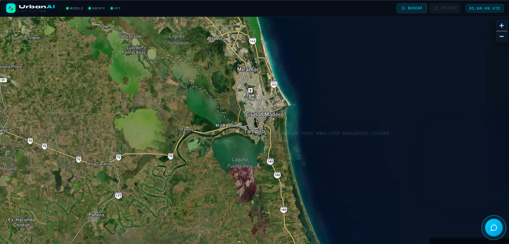
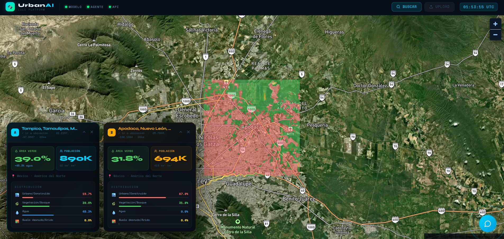
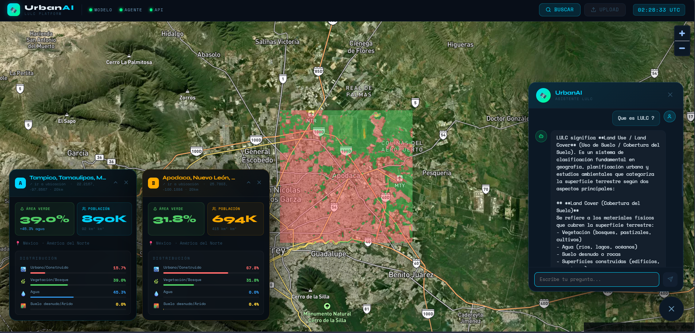

# UrbanAI  
_**Autor:**_ Gustavo de Jesús Escobar Mata.

## Descripción general
Los datos corresponden al catalago de imagenes de Sentinel-2. Se utilizaron imagenes satelitales de: Amsterdam, Bangkok, Bogota, Ciudad de México, Dubai, Houston, Madrid, Monterrey , Mumbai y  Nairobi. La elección fue basada en variedad de suelos y regiones.

## Problema 
El crecimiento acelerado de las ciudades genera una demanda creciente de información precisa y actualizada sobre el uso y cobertura del suelo (Land Use / Land Cover, LULC). Gobiernos, institutos de planeación y organismos de desarrollo urbano requieren conocer, con resolución espacial detallada, cómo se distribuyen las zonas construidas, la vegetación, los cuerpos de agua y el suelo árido dentro de sus territorios; sin embargo, los métodos tradicionales de cartografía (basados en trabajo de campo o fotointerpretación manual) son costosos, lentos y difíciles de escalar a múltiples ciudades simultáneamente.

## Solución
El aprendizaje profundo ofrece una alternativa eficiente: modelos de segmentación semántica capaces de clasificar cada píxel de una imagen satelital de forma automática, a bajo costo y con alta precisión. En este proyecto se propone y evalúa una arquitectura U-Net con encoder EfficientNet-B3 entrenada sobre imágenes multiespectrales Sentinel-2 para clasificar el uso de suelo en 4 categorías (Urbano, Vegetación, Agua y Suelo árido) en 10 ciudades de 6 continentes. El modelo se integra en UrbanAI, una plataforma que combina el modelo con un agente de IA para democratizar el análisis territorial.

## Arquitectura y Entrenamiento
La arquitectura del proyecto está conformada por múltiples componentes clave:

### 1. Modelo de Segmentación Semántica (U-Net + EfficientNet-B3)
Se utiliza una arquitectura U-Net para la segmentación, conformada por:
- **Encoder:** Extrae características jerárquicas reduciendo la resolución espacial. Se utilizó EfficientNet-B3, que aplica un escalado compuesto (compound scaling).
- **Decoder:** Reconstruye la resolución espacial original mediante upsampling y convoluciones transpuestas.
- **Skip connections:** Conexiones simétricas encoder–decoder para preservar la información espacial de alta resolución.
El modelo procesa *patches* de 256x256 píxeles de imágenes Sentinel-2 L2A (10 m/pixel, utilizando 6 bandas: B02, B03, B04, B08, B11, B12).

**Detalles del Entrenamiento:**
El conjunto de datos se dividió en 70% para entrenamiento, 15% para validación y 15% para evaluación (con un total de 105,652 *patches*). 
- **Optimizador:** AdamW (10⁻⁴) con LR Scheduler Cosine Annealing.
- **Función de pérdida:** CrossEntropy + Dice Loss (50/50).
- **Entrenamiento:** 50 épocas con Early Stopping (Patience = 10) y tamaño de batch de 16.

### 2. Agente Inteligente y RAG
El sistema integra un agente basado en herramientas siguiendo el paradigma ReAct (Reasoning + Acting), compuesto por:
- **LLM (Cerebro):** Claude Sonnet.
- **Framework:** LangChain + LangGraph.
- **Herramientas (Actuadores):** `classify_city` (clasifica con el modelo U-Net), `get_city_stats` (estadísticas), `list_cities` y `search_urban_docs` (búsqueda semántica usando RAG).
- **Componente RAG:** Extiende el conocimiento del agente con documentos externos en tiempo de inferencia para mejorar las respuestas sobre estándares urbanos o información específica.

### 3. Implementación Cloud (Google Cloud Platform)
El sistema se implementó en GCP para aprovechar sus capacidades de escalabilidad y disponibilidad:
- **Google Cloud Storage (GCS):** Almacenamiento de imágenes, archivos y el modelo.
- **Cómputo en la Nube:** Uso de máquinas virtuales (VM) con 2 vCPU, 4 GB de RAM, 400 GB SSD, configuradas con autoescalado (de 0 a 3 instancias) y timeout de 120s por petición.

## Metricas
### Metricas generales (Conjunto de Prueba)

| Métrica                  | Valor       |
|--------------------------|-------------|
| Número de clases         | 4           |
| Muestras de prueba       | 22,639      |
| Test Loss                | 0.2019      |
| mIoU                     | 0.8239      |
| Mean F1                  | 0.9000      |
| Exactitud global (pixel) | 92.16%      |
| Tiempo (segundos)        | 1201.89     |

### Metricas por clase (Conjunto de Prueba)

| Clase                   | IoU    | Precisión | Recall | F1 Score |
|-------------------------|--------|-----------|--------|----------|
| Urbano/Construido       | 0.7536 | 0.8472    | 0.8691 | 0.8576   |
| Vegetación/Bosque       | 0.8804 | 0.9367    | 0.9355 | 0.9360   |
| Agua                    | 0.8686 | 0.9322    | 0.9162 | 0.9231   |
| Suelo desnudo/Árido     | 0.7931 | 0.8902    | 0.8767 | 0.8832   |

## Resultados
El modelo realiza segmentación semántica en imágenes satelitales Sentinel-2, clasificando cada píxel en una de las cuatro categorías:
- Urbano/Construido
- Vegetación/Bosque
- Agua
- Árido/Suelo desnudo

### Input vs Output de Tampico, Tamaulipas, México.

La imagen del input de la imagen satelital de Sentinel-2 que tomaremos es la correspondiente a Tampico, Tamaulipas, México.



Al autilizar el modelo entrenado se genero la siguiente imagen del output de la imagen satelital de Sentinel-2, la cual, muestra la distribución de territorio urbano(15.7%), vegetación(39.0%), agua(45.3%) y suelo arido(0.0%). 


Una de las aplicaciones de la plataforma es comparar distintas ciudades, en este caso compararemos Tampico con Apodaca. En esta imagen, podemos encontrar un mayor porcentaje de urbanización (67.8%), un menor porcentaje de vegetación (31.8%) y una nula cantidad de agua (0.0%) y porcentaje pequeño de suelo arido (0.4%).



Por otra parte, podemos consultar con UrbanAI , un agente AI que utiliza la API de Anthropic, información externa o información sobre las ciudades. 



Se añadieron isocronas (min/seg) con tres categorias: a pie, bici, coche y coche en trafico. La opción nos permite obtener poligonos o contorno de hasta donde se puede aceder desde un punto de partida. 


## Investigación futura y limitaciones
- La clase **Industrial** presenta un IoU de 0.0 en el modelo actual. Se requiere reentrenamiento con `class_weight` (pesos inversamente proporcionales a la frecuencia de cada clase) para corregir el desbalance de clases.
- Análisis de predicción de niveles de contaminación mediante datos de Sentinel-5P.
- Despliegue final de la aplicación en Cloud Run de GCP.

## Estructura del proyecto
```bash
Urban-Intelligence-Platform/
├── problemas_autentication_test.py                 Verificar problemas de autenticación
├── .env
├── .gitignore
├── readme.md
├── requirements.txt 
├── notebooks/
├── experiments/  
├── Dockerfile.backend                              Backend para la phase5 
├── Dockerfile.frontend                             Frontend para la phase5
├── nginx.conf                                      Para la phase5
├── cloudbuild.yaml                                 Para la phase5 con GCP
├── deploy.sh                                       Para la phase5 con GCP 
├── documentation                                   Doucmentación del proyecto completo
├── references                                      Articulos de referencias para el proyecto
├── images/
│    ├── images_readme                              Imagenes mostradas en el readme              
│    └── images_test                                Imagenes prueba para subir a la plataforma
├── data/
│    ├── chroma_db/ 
│    ├── processed/                                 Carpeta de datos procesados
│    └── raw/                                       Carpeta de datos sin procesar 
├──  models/
│    ├── best_model.pth                             Mejor modelo obtenido
│    ├── lulc_cache.json                            Cache  
│    └── results_test_results.json                  Evaluacion del modelo 
├──  docs/
│    └── knowledge/
│        ├── doc_onu_habitat_estandares.txt   
│        ├── doc_lulc_sentinel2.txt  
│        └── doc_ciudades_perfil.txt                            
└── src/
    ├── cities_config.py                            Selección de las ciudades. 
    ├── data_downloader.py                          Descarga las imagnees del Sentinel-2
    ├── evaluate.py                                 Evaluación del modelo
    ├── get_worldcover_tiles.py                     Obten los tiles de WorldCover para las ciudades
    ├── preprocessor.py                             Preprosesamiento de las imagnees
    ├── prueba_autenticación.py                     Prueba de autenticación de Sentinel-2
    ├── train.py                                    Entrenamiento de modelo
    ├── worldcover_downloader.py                    Descarga de Titles de las imagenes  
    ├── phase3/                                     Fase de implementación de agentes con Anthropic
    │    ├── _init_.py
    │    ├── agent.py 
    │    ├── api.py
    │    ├── inference.py
    │    ├── rag.py
    │    └── tools.py
    ├── phase4/                                     Fase de Frontend
    │    ├── package.json                            
    │    ├── vite.config.js
    │    ├── index.html
    │    ├── main.jsx
    │    ├── App.jsx 
    │    └── components/
    │          ├── Map.jsx
    │          ├── FloatingChat.jsx
    │          ├── CityCard.jsx
    │          ├── SearchPanel.jsx
    │          ├── IsochronePanel.jsx 
    │          └── UploadModal.jsx
    └── phase5/
         ├── __init__.py
         ├── api.py
         ├── sentinel_hub.py
         └── inference_gcs.py
```